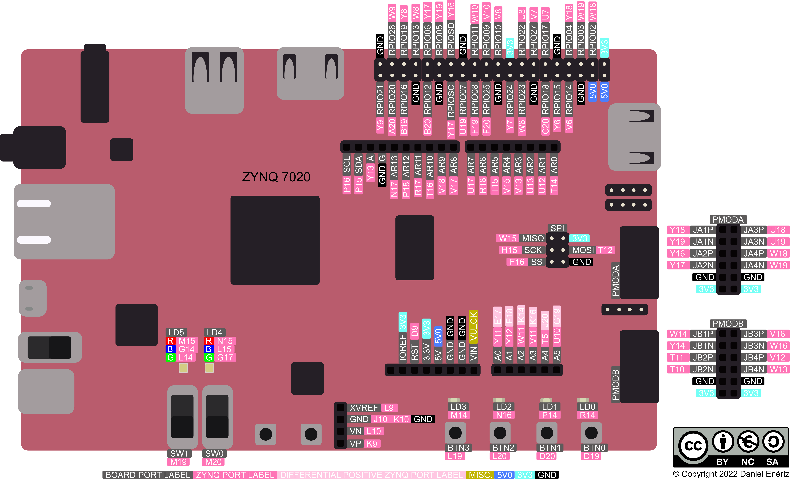

# Car_Project

## Description
This project involves building a robot using the PYNQ-Z2 board. The robot includes the following features:
- [Ultrasonic sensor for obstacle detection](Demo_Videos/Ultrasoon_DemoVideo.mp4)
- Speed sensor and motor control
- Inertial Measurement Unit (IMU)
- Fully functional car project

## Hardware Requirements
- **Motor driver module** (L298N)
- **Power supply** (PowerBank)
- **Joykit robotic car chassis**

  
- **PYNQ-Z2 FPGA board**

  

## Pin Configuration
### Ultrasoon Sensor
- **Right sensor**
  - `sonar_trig_0 = Pin_Y18`
  - `sonar_echo_0 = Pin_Y19`
- **Left sensor**
  - `sonar_trig_1 = Pin_Y16`
  - `sonar_echo_1 = Pin_Y17`